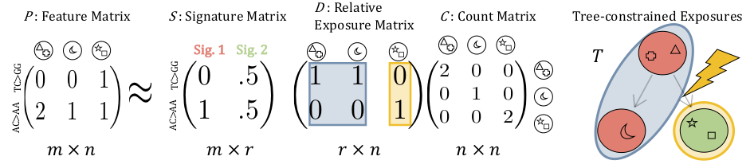
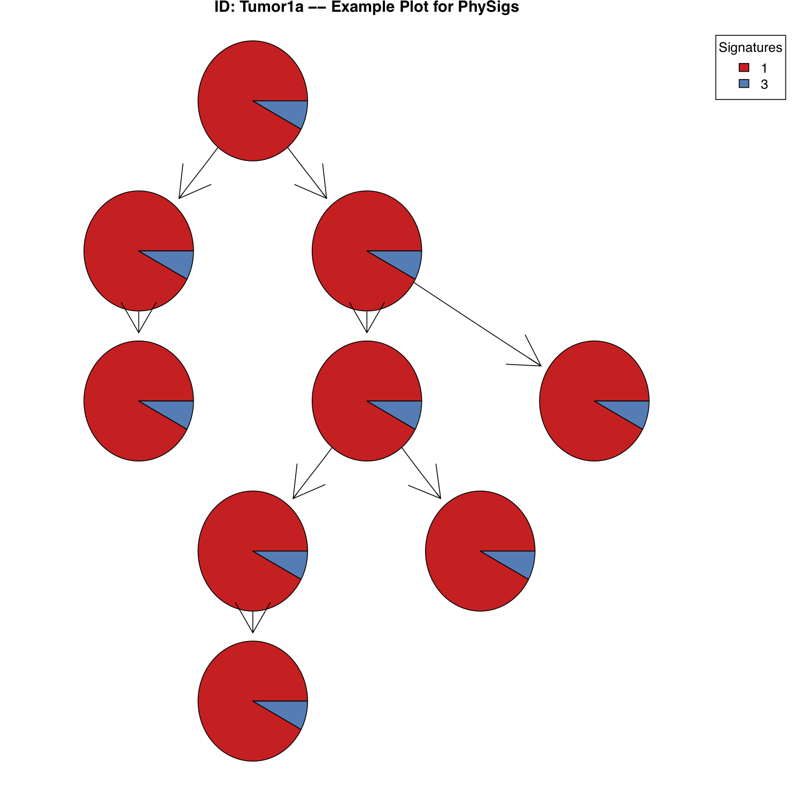

# PhySigs: Phylogenetic Inference of Mutational Signature Dynamics

The input to PhySigs is a phylogeny with nodes representing clones in a patient tumor, a signature matrix containing the set of mutational signatures to use in the analysis, and a feature matrix for the set of mutations introduced in each clone. In particular, the mutational categories in the feature matrix should correspond to the mutational categories used in the signature matrix.  Currently, PhySigs supports the standard 96 mutational categories for SNVs for [COSMIC V2](https://cancer.sanger.ac.uk/cosmic/signatures_v2) signatures.   



PhySigs automatically computes the count matrix, as it is simply a diagonal matrix containing the sum of columns in the feature matrix. PhySigs then solves the Tree-constrained Exposure (TE) problem for all possible clusterings of the clones that correspond to a partition of the phylogeny. The output of the TE problem is a relative exposure matrix composed of groups of identical columns corresponding to clusters of clones with identical exposures (denoted by blue and yellow). Edges between these clusters in the phylogeny are interpreted to be where exposure shifts occurred (denoted by a lightning bolt). PhySigs uses the Bayesian Information Criterion to select the number of clusters that best explain the data (2 clusters depicted).

## Contents

  1. [Getting started](#start)
     * [Dependencies](#dep)
  2. [Usage instructions](#usage)
     * [I/O formats](#io)
     * [normalizeFeatureMatrix](#norm)
     * [allTreeExposures](#all)
     * [getError](#error)
     * [getBIC](#bic)
     * [plotTree](#plot)

<a name="start"></a>

## Getting started

PhySigs is written in R. The implementation was develped and tested in R Version 3.6.1. The repository is organized as follows:

| Folder    | DESCRIPTION                                                  |
| --------- | ------------------------------------------------------------ |
| `src`     | source code for PhySigs                                      |
| `data`    | example input data for PhySigs                               |
| `results` | example code using PhySigs to analyze input data and corresponding results |

<a name="dep"></a>

### Dependencies   

PhySigs has the following dependencies to perform signature exposure inference:

* [deconstructSigs](https://cran.r-project.org/web/packages/deconstructSigs/index.html) (>= 1.8.0)
* [graph](http://www.bioconductor.org/packages/release/bioc/html/graph.html) (>= 3.9)

PhySigs has the following optional dependencies, which may be used to visualize the results:

* [Rgraphviz](https://bioconductor.org/packages/release/bioc/html/Rgraphviz.html) (>= 3.9)
* [RColorBrewer](https://cran.r-project.org/web/packages/RColorBrewer/index.html) (>= 1.1-2)

<a name="usage"></a>

## Usage instructions

Here we walk through the pipeline of how to use PhySigs. The code provided in this tutorial can be found at ./results/example.R. 

<a name="io"></a>

### I/O formats

PhySigs takes as input a phylogeny represented as a graph::graphNEL object, with nodes labeled by each clone. It also takes as input a feature matrix whose row labels correspond to the nodes in the phylogeny and whose column labels correspond to mutational categories (e.g. "A[C>A]A"). The final input is a character vector containing the names for the subset of COSMIC V2 signatures to include.

An example of how to set the signature vector.

```R
# Input subset of COSMIC signatures
S <- c("Signature.1", "Signature.3")
```

An example of how to construct the phylogeny from a csv file with rows containing edges of the tumor phylogeny. 

```R
# Input CSV file 
tree_matrix <- read.csv(file="../data/example/tree.csv", header=TRUE, sep=",")

# V1/V2 contains clone label for first/second endpoint of edge
V1 <- as.character(tree_matrix$V1)
V2 <- as.character(tree_matrix$V2)

# Get nodes in the tree
node_ids <- unique(union(V1, V2))

# Initialize a tree 
T <- new("graphNEL", nodes=node_ids, edgemode="directed")

# Add edges to the tree
for (i in 1:nrow(tree_matrix)){
  T <- addEdge(V1[i], V2[i], T, 1)
}
```

An example of how to construct the feature matrix from a CSV file of SNVs.

```R
# Input CSV file
input_mat <- as.data.frame(read.csv(file="./data/example/snv.csv", 
             colClasses = c("character", "character", "numeric", "character", "character")))

# Use deconstructSigs to convert SNVs to 96 Features
P <- mut.to.sigs.input(mut.ref = input_mat, 
                    sample.id = "Sample", 
                    chr = "chr", 
                    pos = "pos", 
                    ref = "ref", 
                    alt = "alt")
```

<a name="norm"></a>

### normalizeFeatureMatrix

This function takes as input feature matrix and adjusts the counts based on the trinucleotide context fraction. The backend of this function relies on getTriContextFraction in deconstuctSigs. Possible normalization options include: "default", "genome", and "exome". Please see deconstructSigs [documentation](https://github.com/raerose01/deconstructSigs) for more information on the normalization procedure. 

```R
# Normalize feature matrix
P_Norm <- normalizeFeatureMatrix(P, "genome")
```

<a name="all"></a>

### allTreeExposures

This function takes as input a phylogeny, the signature vector, and the normalized feature matrix. It returns a list of exposure matrices whose entries correspond to the best partition of the phylogeny for each possible number of clusters. Each exposure matrix has a row for each requested signature and a column for each cluster of clones induced by the partition of the phylogeny. 

```R
# Recover lowest error exposure matrix for every possible number of clusters. 
E_list <- allTreeExposures(T, P_Norm, S)
```

<a name="error"></a>

### getError

Given a normalized feature matrix, estimated exposures, and signature matrix, this function returns the Frobineous norm between the reconstructed feature matrix and the normalized feature matrix.

```R
# Get error for exposure matrix from best set of k clusters.
k <- 1
error <- getError(P_Norm, E_list[[k]], S)
```

<a name="bic"></a>

### getBIC

Given a normalized feature matrix, estimated exposures, and signature matrix, this function returns the Bayesian information criterion based on the error between the reconstructed feature matrix and the normalized feature matrix.

```R
# Get BIC for exposure matrix from best set of k clusters. 
bic <- getBIC(P_Norm, E_list[[k]], S)
```

<a name="plot"></a>

### plotTree

The inputs to this function are the tumor phylogeny, normalized feature matrix, and exposure matrix. To annotate the plot, the function also requires a tumorID (useful when analyzing more than 1 tumor), a plot title, and optionally a tree index (useful when tumor has more than 1 possible tree).

```R
# Get tree figure with pie chart nodes showing exposures.
tumorID <- "Tumor1"
title <- "Example Plot for PhySigs"
plotTree(tumorID, title, T, P_Norm, E_list[[k]], tree_idx=1)
```

Running all of these steps together should result in the following plot.



